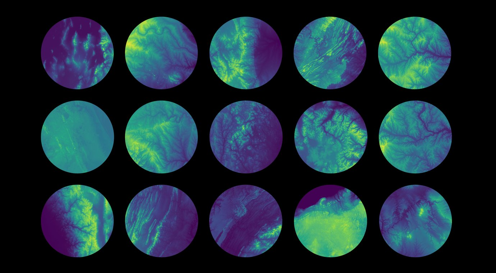
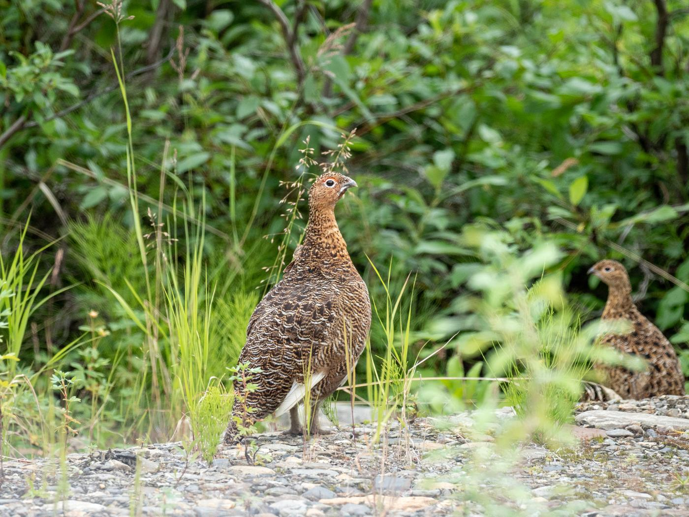
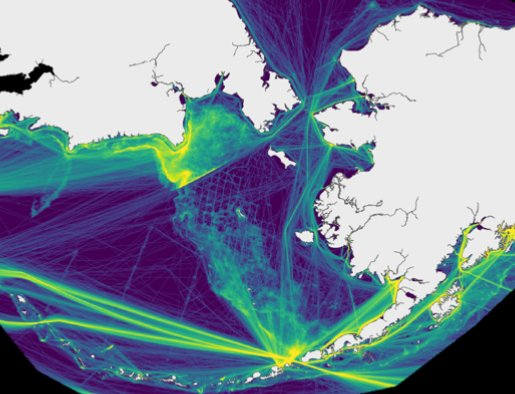
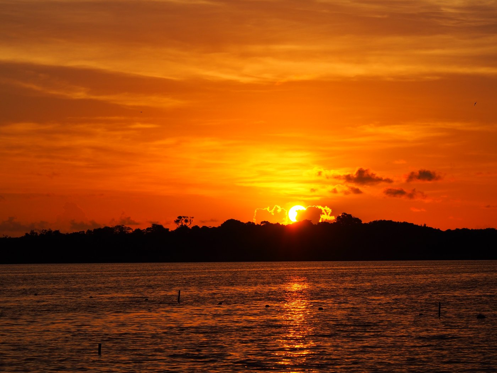
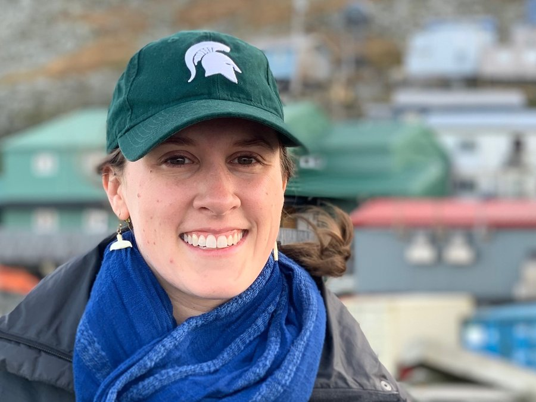

::: {.hero style="background-image: url('images/hero-home.jpg');"}
::: {.hero-inner}

# Kelly Kapsar

::: {.tagline}
Environmental Data Scientist | Spatial Ecologist | Systems Thinker
:::

::: {.lede}
I use interdisciplinary approaches to analyze large, spatiotemporal data sets generated from remote sensing, systematic sampling, and movement tracking to answer complex questions about global change. Through open science, reproducible research, and science communication, I share my data and findings with a broad audience.  
:::

[View my research](research.qmd){.btn-hero .solid}
[Get in touch](contact.qmd){.btn-hero}

:::
:::

<!-- ====================================================================== -->

::: {.band .band-sand}
::: {.band-inner}

::: {.section-label}
What I do
:::

## Data-driven answers to conservation questions

::: {.project-grid}

::: {.project-card style="border:none; background:transparent;"}
::: {.pc-body style="padding:0;"}
### Spatiotemporal data analysis across scales
Ten years of satellite vessel tracking, continental-scale climate and terrain
layers, and bird interaction networks across the Western Hemisphere are a few of the data sets I have worked with in recent years.
:::
:::

::: {.project-card style="border:none; background:transparent;"}
::: {.pc-body style="padding:0;"}
### Open, reusable data products
I ensure that datasets are published, versioned, and citable through reputable
repositories (e.g., Arctic Data Center and the Environmental Data Initiative),
with documentation and code so others can pick them up and run them.
:::
:::

::: {.project-card style="border:none; background:transparent;"}
::: {.pc-body style="padding:0;"}
### Science communication to diverse audiences
In addition to scientific conferences, I have presented my research to coastal
Arctic communities, US Fish and Wildlife Service, US Coast Guard, and
environmental NGOs, among others. It is my goal to reach the people most
interested in and affected by the results of my research.
:::
:::

:::

::: {style="margin-top:2.5rem;"}
[R]{.tag} [Spatial statistics]{.tag} [Python]{.tag}
[ArcGIS]{.tag} [Git / GitHub]{.tag}
[Reproducible workflows]{.tag} [Remote sensing]{.tag}
[Stakeholder engagement]{.tag} [Spanish (proficient)]{.tag}

:::

:::
:::

<!-- ====================================================================== -->

::: {.band}
::: {.band-inner}

::: {.section-label}
Current work
:::

## What I'm working on now

::: {.lead-text}
My current research projects focus on biodiversity data infrastructure, avian
macroecology, Arctic marine spatial planning, and climate intervention policy.
:::

::: {.project-grid}

::: {.project-card}

::: {.pc-body}
::: {.pc-meta}
Biodiversity data infrastructure
:::
### Multi-scale environmental geodiversity for the National Ecological Observatory
Network (NEON)
A continental-scale set of terrain and climate heterogeneity data layers
calculated across multiple spatial scales for every NEON site — plus an
adaptable workflow so the same layers can be generated anywhere.

::: {.pc-links}
[Read more](research.qmd#neon) · [Paper](https://doi.org/10.1038/s41597-026-07613-5) · [Data](https://portal.edirepository.org/)
:::
:::
:::

::: {.project-card}

::: {.pc-body}
::: {.pc-meta}
Macroecology
:::
### Avian MetaNetwork
Ecologists can't predict where species will occur without knowing how they
interact — the "Eltonian shortfall." The Avian MetaNetwork closes that gap by
systematically collecting and integrating bird–bird interaction data across the
Western Hemisphere.

::: {.pc-links}
[Read more](research.qmd#metanetwork)
:::
:::
:::

::: {.project-card}

::: {.pc-body}
::: {.pc-meta}
Marine spatial planning
:::
### Vessel dynamics in the Bering Strait
Mapping how ship traffic is reorganizing in a fast-changing maritime
bottleneck, and what that reorganization means for the wildlife and coastal
communities who live there and depend on its resources.

::: {.pc-links}
[Read more](research.qmd#bering)
:::
:::
:::

::: {.project-card}

::: {.pc-body}
::: {.pc-meta}
Climate intervention
:::
### Ecological risk of solar radiation modification
Stratospheric aerosol injection has been proposed to buy time to address
climate change, but its ecological consequences are largely unknown. This
project uses experiments, ecological analogs, and extreme-event forecasting to
predict what it could do to ecosystems.

::: {.pc-links}
[Read more](research.qmd#srm)
:::
:::
:::

:::

:::
:::

<!-- ====================================================================== -->

<!-- ====================================================================== -->

::: {.band .band-sand}
::: {.band-inner}

::: {.two-col}

::: {}
{.headshot}
:::

::: {}
::: {.section-label}
About
:::

## A short version

I hold a Ph.D. in Fisheries & Wildlife from Michigan State University and a
B.A. in Biology from Carleton College. I currently work as a data scientist
and postdoctoral researcher with the [Institute for Biodiversity, Ecology,
Evolution, and Macrosystems](https://www.ibeem.msu.edu) and the [Spatial &
Community Ecology Lab]( https://www.communityecologylab.com/) at MSU.

My interdisciplinary work focuses on developing reproducible workflows and
open source tools and data sets to answer both applied conservation questions
and test cross-scale ecological theories. While I have been based in academia,
I have worked in partnership with researchers in government and NGOs for more
than 10 years. Community engagement and science communication are also
important parts of my career, and I have translated science for diverse
audiences from preschoolers to senior citizens.

[Read the full CV](cv.qmd){.btn-hero style="border-color:#1f4d47; color:#1f4d47 !important;"}
:::

:::

:::
:::
