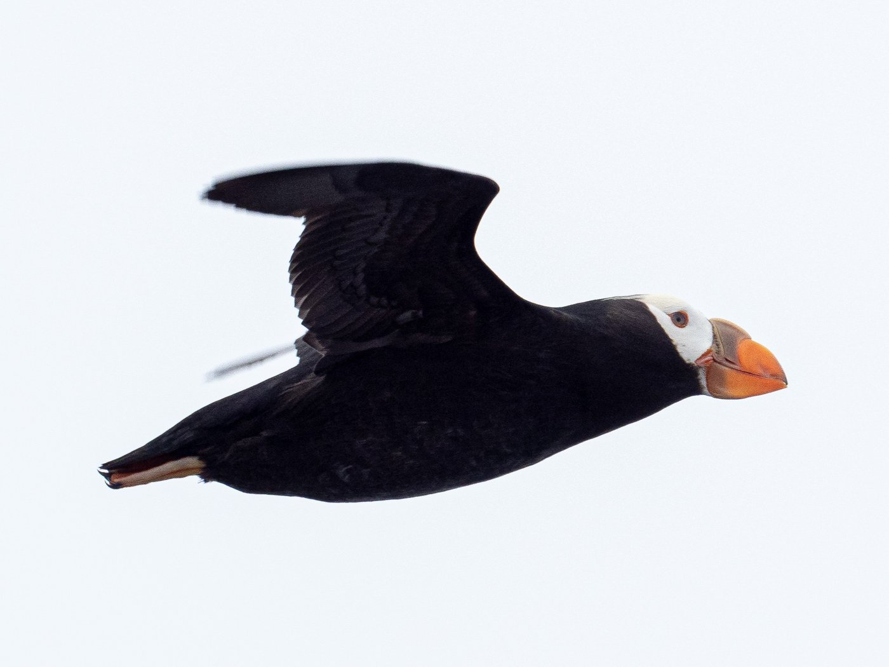
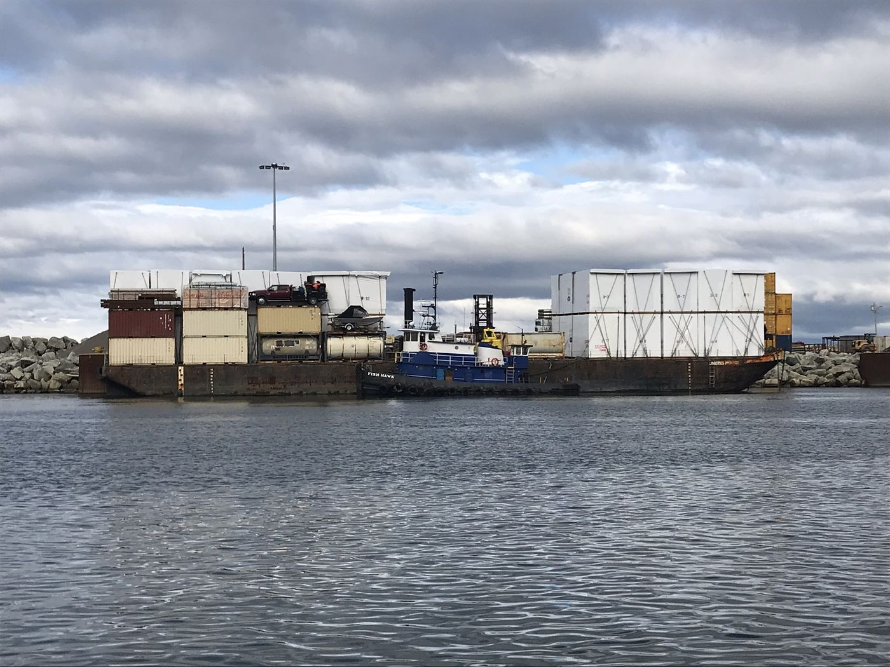
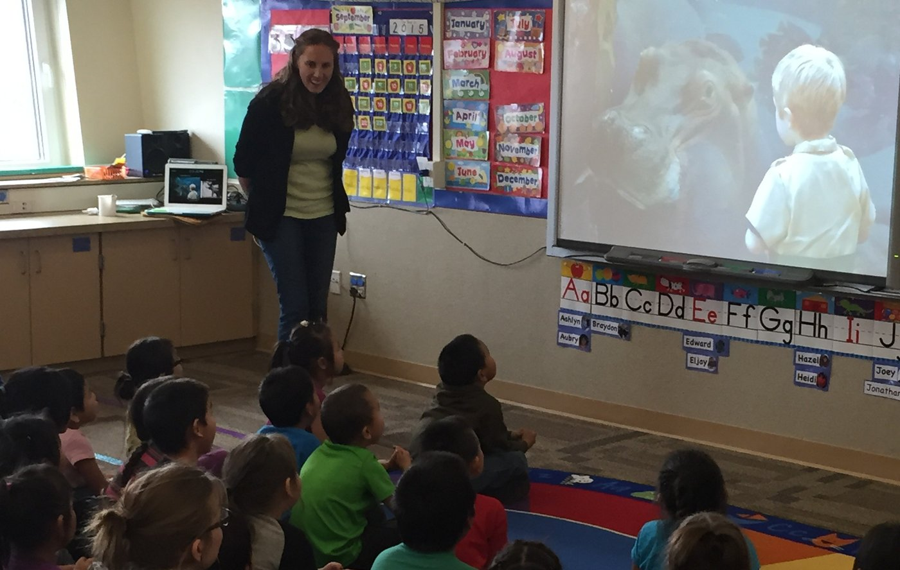

::: {.hero .hero-sm}

```{=html}
<video class="hero-video" autoplay loop muted playsinline poster="images/hero-research.jpg">
  <source src="images/hero-research.mp4" type="video/mp4">
</video>
```

::: {.hero-inner}
# Research

::: {.lede}
I work on applied conservation problems that are limited by data — where the
question is answerable, but only if someone assembles, cleans, and analyzes
information at a scale that hasn't been attempted yet.
:::
:::
:::

::: {.band}
::: {.band-inner}

::: {.section-label}
Current projects
:::

## Active work

<!-- ------------------------------------------------------------------ -->
::: {#neon .feature}
::: {.feature-text}
::: {.pc-meta}
Biodiversity data infrastructure · 2023–present
:::
### Multi-scale environmental geodiversity for NEON

Environmental heterogeneity — the roughness of terrain, the variety of soils,
the swing of the climate — shapes where species can live. But the scale at which
you measure that heterogeneity changes the answer, and most analyses pick one
scale and hope.

I built a set of geodiversity and climate layers for every National Ecological
Observatory Network site in the United States, calculated across multiple
spatial scales, together with an adaptable workflow that lets other researchers
generate the same layers for any area of interest. The data are published and
versioned through the Environmental Data Initiative; the workflow is on GitHub.

**Why it matters for practitioners:** the same pipeline that serves NEON
researchers can characterize environmental heterogeneity for a mitigation site,
a proposed reserve, or a regional planning footprint.

**Role:** Lead author and analyst. **Collaborators:** Zarnetske Lab (MSU),
Baiser (UF), Record (Penn State), Strecker (PSU), Bills, Kounta.

[Paper (*Scientific Data*, 2026)](https://doi.org/10.1038/s41597-026-07613-5) ·
[Code](https://github.com/kellykapsar)
:::
::: {.feature-img}

:::
:::

<!-- ------------------------------------------------------------------ -->
::: {#metanetwork .feature .reverse}
::: {.feature-text}
::: {.pc-meta}
Macroecology · [YEARS]
:::
### Avian MetaNetwork

::: {style="background:#fdf6ee; border-left:3px solid #c0662f; padding:1rem 1.2rem;"}
**PLACEHOLDER — I need your input here.** You asked me not to assume, and I
don't have reliable details on this project. Send me:

1. Two to three sentences on the core question.
2. Funder and award, if any.
3. Key collaborators and your role.
4. Current status (in progress / in review / preprint) and any links.
5. One figure or photo I can use.
:::
:::
::: {.feature-img}

:::
:::

<!-- ------------------------------------------------------------------ -->
::: {#bering .feature}
::: {.feature-text}
::: {.pc-meta}
Marine spatial planning · 2016–present
:::
### Navigating change in the Bering Strait

The Bering Strait is a narrow, shallow gateway between the Pacific and the
Arctic. Sea ice loss is lengthening the shipping season through it, and traffic
is not just increasing — it is reorganizing, in ways that matter for subsistence
hunting, marine mammals, and spill risk.

Using more than a decade of satellite AIS data, I track how vessel routes,
seasonality, and traffic composition are shifting, and evaluate whether
management measures are changing behavior on the water. Related work with
colleagues found measurable effects of the International Maritime Organization's
"Areas to be Avoided" designations on vessel movement in the Strait.

**Why it matters for practitioners:** this is spatial planning evidence — where
traffic is going, when, and whether a designation actually moved ships.

**Role:** Lead analyst; co-author on associated policy analyses.
**Presented to:** Alaska Marine Science Symposium (2026), IALE-NA (2025), Alaska
Marine Policy Forum, USFWS Oil Spill Team, Northern Latitudes Partnerships.

[ATBA policy analysis (*Marine Policy*, 2025)](https://doi.org/10.1016/j.marpol.2025.106849) ·
[Ice-covered waters analysis (*Climatic Change*, 2023)](https://doi.org/10.1007/s10584-023-03568-3) ·
[Shipping Across the Arctic StoryMap](https://storymaps.arcgis.com/stories/8b3d286071cf4df2a443c0ccfbecda60)
:::
::: {.feature-img}

:::
:::

<!-- ------------------------------------------------------------------ -->
::: {#srm .feature .reverse}
::: {.feature-text}
::: {.pc-meta}
Climate intervention · 2025–present
:::
### Solar radiation modification

::: {style="background:#fdf6ee; border-left:3px solid #c0662f; padding:1rem 1.2rem;"}
**PLACEHOLDER — I need your input here.** Your CV lists a 2025 Environmental
Defense Fund award ($270,000) for solar radiation modification work, but I don't
know the substance. Send me:

1. The research question in two to three sentences.
2. Your role (PI? Co-I? Lead analyst?) and whether the award is to you.
3. Whether the ecological-impacts angle is the focus, and at what scale.
4. Whether you want this featured at all — SRM is contested, and some NGO
   audiences may read it differently than a consulting firm would. Happy to
   move it lower or leave it off.
:::
:::
::: {.feature-img}

:::
:::

:::
:::

<!-- ====================================================================== -->

::: {.band .band-sand}
::: {.band-inner}

::: {.section-label}
Selected past work
:::

## Completed projects

::: {.project-grid}

::: {.project-card}


::: {.pc-body}
::: {.pc-meta}
Risk assessment · Alaska
:::
### Seabird–vessel risk across Alaska's oceans
A multi-scale, seasonal analysis combining at-sea seabird survey data with
satellite vessel tracking to identify where and when ships and seabirds overlap
across Alaska's marine regions. Produced as a peer-reviewed paper and as a
technical appendix for the Bureau of Ocean Energy Management — a direct input to
offshore planning and spill-response prioritization.

*With Benjamin Sullender (Audubon Alaska) and Kathy Kuletz (USFWS).*

::: {.pc-links}
[Paper (*Conservation Biology*, 2025)](https://doi.org/10.1111/cobi.70115) ·
[BOEM report](https://www.boem.gov/regions/alaska-ocs-region/scientific-and-technical-publications-2022)
:::
:::
:::

::: {.project-card}


::: {.pc-body}
::: {.pc-meta}
Open data product
:::
### North Pacific & Arctic marine traffic dataset
A spatially explicit, publicly available dataset of monthly shipping intensity
across the North Pacific and Arctic, 2015–2020, built from raw satellite AIS and
released with full documentation at multiple resolutions. Downloaded and reused
by agencies, NGOs, and researchers who previously had no consistent regional
traffic layer to work from.

::: {.pc-links}
[Paper (*Data in Brief*, 2022)](https://doi.org/10.1016/j.dib.2022.108531) ·
[Data (Arctic Data Center)](https://doi.org/10.18739/A2J678Z16)
:::
:::
:::

::: {.project-card}


::: {.pc-body}
::: {.pc-meta}
Community-engaged conservation · 2015–2025
:::
### Saint Louis Zoo Arctic WildCare Program
A decade as a research associate with the Zoo's Arctic Socio-Environmental
Initiative, working on community engagement in conservation with Alaskan
partners. This is where my research questions come from: sustained relationships
with the people who live with the outcomes, and a habit of asking what a
community actually needs to know before designing the study.


::: {.pc-links}
[Program](https://stlzoo.org/) ·
[Related writing](https://natureecoevocommunity.nature.com/users/178448-kelly-kapsar)
:::
:::
:::

:::

:::
:::
