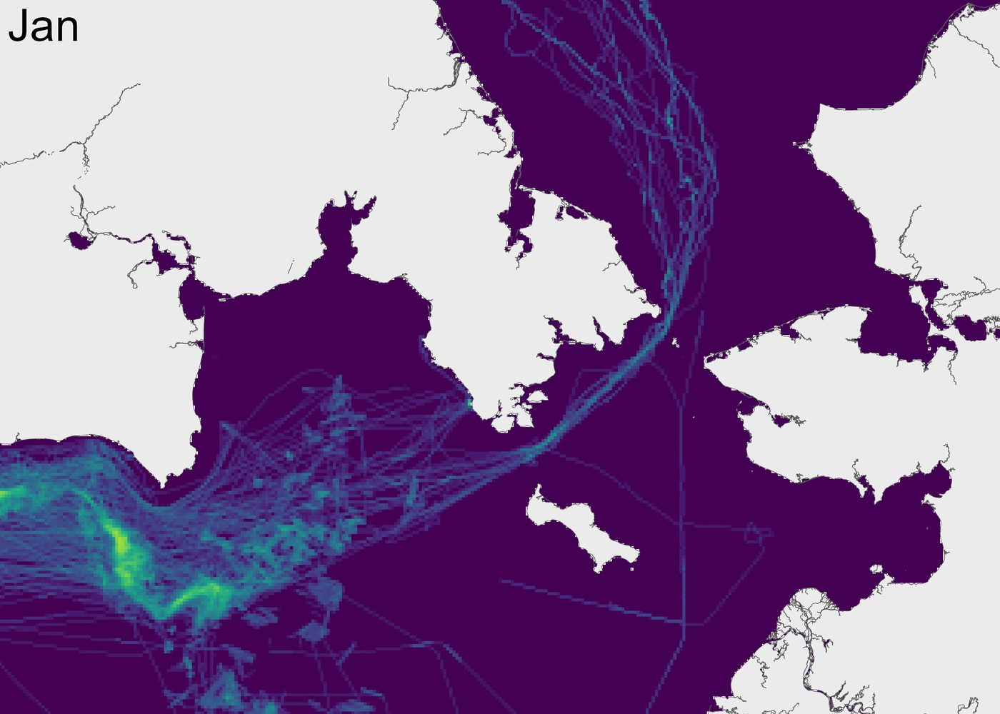
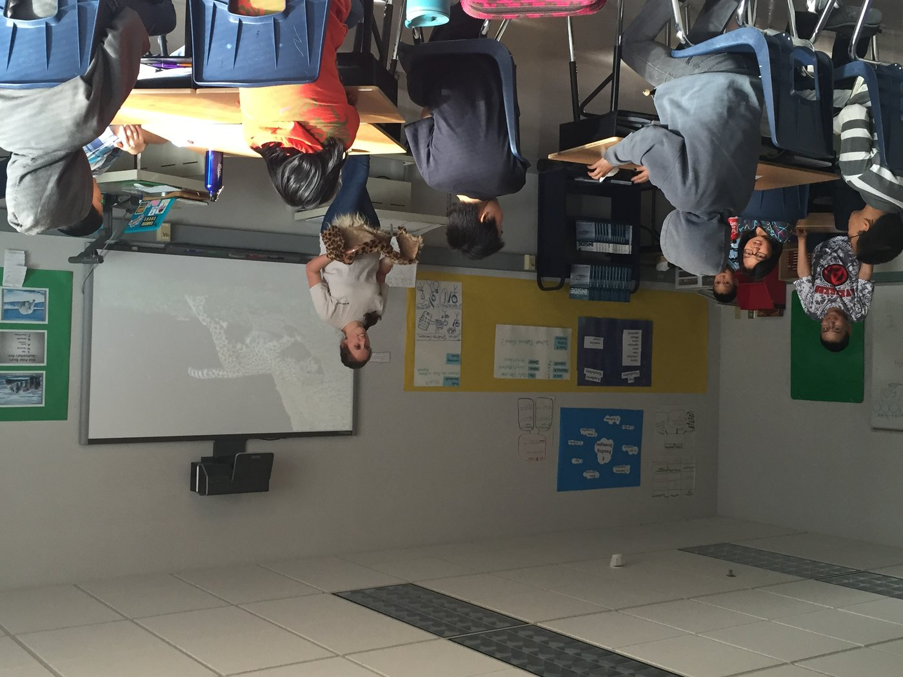

::: {.hero .hero-sm style="background-image: url('images/hero-talks.jpg');"}
::: {.hero-inner}
# Talks & Outreach

::: {.lede}
Talks to scientific societies, federal agencies, and policy forums, along with
public writing, outreach, and teaching.
:::
:::
:::

::: {.band .band-deep}
::: {.band-inner}

::: {.section-label style="color:#e8a97a;"}
Audiences
:::

## Where I've presented

[USFWS Oil Spill Team]{.tag} [Bureau of Ocean Energy Management]{.tag}
[Alaska Marine Policy Forum]{.tag} [Northern Latitudes Partnerships]{.tag}
[Arctic Vessel Traffic Working Group]{.tag}
[Distributed Biological Observatory]{.tag}
[Ecological Society of America]{.tag}
[American Geophysical Union]{.tag}
[IALE North America]{.tag} [Alaska Marine Science Symposium]{.tag}
[Smithsonian NMAI]{.tag} [Women in Nature Network]{.tag}

:::
:::

<!-- ====================================================================== -->

::: {.band}
::: {.band-inner}

::: {.section-label}
Invited & conference presentations
:::

## Selected talks

::: {}

::: {.talk-item}
::: {}
::: {.talk-year}
2026
:::
::: {.talk-kind}
Invited webinar
:::
:::
::: {}
::: {.talk-title}
AI in ecological research: Approaches to and applications of open access models
:::
::: {.talk-venue}
Ecological Society of America, Open Science Section Webinar Series · Virtual
:::
:::
:::

::: {.talk-item}
::: {}
::: {.talk-year}
2026
:::
::: {.talk-kind}
Conference
:::
:::
::: {}
::: {.talk-title}
Navigating change: Mapping vessel dynamics in the rapidly evolving Bering Strait
:::
::: {.talk-venue}
Alaska Marine Science Symposium · Anchorage, AK
:::
:::
:::

::: {.talk-item}
::: {}
::: {.talk-year}
2025
:::
::: {.talk-kind}
Invited seminar
:::
:::
::: {}
::: {.talk-title}
Multi-scale environmental geodiversity and climate data layers for NEON analyses across scales
:::
::: {.talk-venue}
University of Illinois at Chicago · Chicago, IL
:::
:::
:::

::: {.talk-item}
::: {}
::: {.talk-year}
2025
:::
::: {.talk-kind}
Conference
:::
:::
::: {}
::: {.talk-title}
Multi-scale environmental geodiversity and climate data layers for NEON analyses across scales
:::
::: {.talk-venue}
Ecological Society of America · Baltimore, MD
:::
:::
:::

::: {.talk-item}
::: {}
::: {.talk-year}
2025
:::
::: {.talk-kind}
Conference
:::
:::
::: {}
::: {.talk-title}
Navigating change: Mapping metacoupled vessel dynamics in the rapidly evolving Bering Strait
:::
::: {.talk-venue}
International Association for Landscape Ecology, N. America Chapter · Raleigh, NC
:::
:::
:::

::: {.talk-item}
::: {}
::: {.talk-year}
2024
:::
::: {.talk-kind}
Conference
:::
:::
::: {}
::: {.talk-title}
Quantifying risk of vessel encounters with sea ducks in the North Pacific: A multi-scale seasonal analysis of Alaskan oceans
:::
::: {.talk-venue}
International Sea Duck Conference · Virtual
:::
:::
:::

::: {.talk-item}
::: {}
::: {.talk-year}
2024
:::
::: {.talk-kind}
Poster
:::
:::
::: {}
::: {.talk-title}
Recent patterns of vessel risk to seabirds: A multi-scale seasonal analysis · and · Data and workflows for macrosystems biodiversity
:::
::: {.talk-venue}
IALE North America (Oklahoma City, OK) · NSF Macrosystems Biology Meeting (Virtual)
:::
:::
:::

::: {.talk-item}
::: {}
::: {.talk-year}
2023
:::
::: {.talk-kind}
Conference
:::
:::
::: {}
::: {.talk-title}
Seabird-vessel traffic risk analysis for Alaska's oceans
:::
::: {.talk-venue}
Alaska Marine Science Symposium · Anchorage, AK
:::
:::
:::

::: {.talk-item}
::: {}
::: {.talk-year}
2022
:::
::: {.talk-kind}
Agency & policy briefings
:::
:::
::: {}
::: {.talk-title}
A new, publicly available marine vessel traffic dataset for the North Pacific and southern Arctic Oceans, 2015–2020
:::
::: {.talk-venue}
USFWS Oil Spill Team · Alaska Marine Policy Forum · Northern Latitudes Partnerships–USFWS · Alaska Marine Science Symposium
:::
:::
:::

::: {.talk-item}
::: {}
::: {.talk-year}
2022
:::
::: {.talk-kind}
Conference
:::
:::
::: {}
::: {.talk-title}
The metacoupled Arctic: Human–nature interactions across local to global scales as drivers of sustainability
:::
::: {.talk-venue}
American Geophysical Union · Chicago, IL
:::
:::
:::

::: {.talk-item}
::: {}
::: {.talk-year}
2020
:::
::: {.talk-kind}
Working meeting
:::
:::
::: {}
::: {.talk-title}
Linking coupled human and natural systems approaches with the Distributed Biological Observatory
:::
::: {.talk-venue}
5th DBO Data Meeting · Seattle, WA
:::
:::
:::

::: {.talk-item}
::: {}
::: {.talk-year}
2018
:::
::: {.talk-kind}
Symposium organizer
:::
:::
::: {}
::: {.talk-title}
Telecoupling symposium organizer; Quantifying the spatio-temporal distribution of marine vessel traffic in the Bering Strait
:::
::: {.talk-venue}
US Chapter, International Association for Landscape Ecology · Chicago, IL
:::
:::
:::

::: {.talk-item}
::: {}
::: {.talk-year}
2017
:::
::: {.talk-kind}
Public lecture
:::
:::
::: {}
::: {.talk-title}
[Zebras in the Arctic: Branching out from the McDonnell Polar Bear Point Project](https://www.youtube.com/watch?v=YrOVJQPDNEQ)
:::
::: {.talk-venue}
Smithsonian National Museum of the American Indian · Washington, D.C. · *Recording available*
:::
:::
:::

:::

::: {style="margin-top:2rem; font-size:0.92rem; color:#55635f;"}
*Full presentation history — including 2021 and earlier — is in the [CV](cv.qmd).*
:::

:::
:::

<!-- ====================================================================== -->

::: {.band .band-sand}
::: {.band-inner}

::: {.section-label}
Public writing & products
:::

## Science communication

::: {.project-grid}

::: {.project-card}

::: {.pc-body}
### Shipping Across the Arctic
An interactive ArcGIS StoryMap exploring the relationships between ships,
communities, and wildlife in the Bering Strait — built to make a technical
dataset legible to a general and policy audience.

::: {.pc-links}
[View StoryMap](https://storymaps.arcgis.com/stories/8b3d286071cf4df2a443c0ccfbecda60)
:::
:::
:::

::: {.project-card}
](images/outreach-cruise.jpg)

::: {.pc-body}
### Breaking the Ice
An essay for *Spotlight Magazine* on what changed about my research after three
weeks aboard the USCGC Healy in the Bering and Chukchi Seas.

::: {.pc-links}
[Read](https://spotlight-msu.medium.com/breaking-the-ice-connecting-data-and-reality-on-an-arctic-research-cruise-a8f8028ff7f4)
:::
:::
:::

::: {.project-card}

::: {.pc-body}
### Zoos should leave the ark metaphor behind
An argument in the *Nature Ecology & Evolution* community blog that zoos should
frame their conservation mission around the UN Sustainable Development Goals.

::: {.pc-links}
[Read](https://natureecoevocommunity.nature.com/users/178448-kelly-kapsar)
:::
:::
:::

:::

:::
:::

<!-- ====================================================================== -->

::: {.band}
::: {.band-inner}

::: {.section-label}
Teaching & training
:::

## Instruction

::: {.talk-item}
::: {}
::: {.talk-year}
2025
:::
:::
::: {}
::: {.talk-title}
**Instructor** — Spatial Ecology (IBIO 870)
:::
::: {.talk-venue}
Integrative Biology, Michigan State University
:::
:::
:::

::: {.talk-item}
::: {}
::: {.talk-year}
2024
:::
:::
::: {}
::: {.talk-title}
**Co-instructor** — Collaborative Coding for Scientific Research: Git, GitHub, and open science
:::
::: {.talk-venue}
Workshop · Integrative Biology, Michigan State University
:::
:::
:::

::: {.talk-item}
::: {}
::: {.talk-year}
2024
:::
:::
::: {}
::: {.talk-title}
**Guest lecture** — Open Science: Strengthening Trust and Reproducibility
:::
::: {.talk-venue}
Integrative Biology, Michigan State University
:::
:::
:::

::: {.talk-item}
::: {}
::: {.talk-year}
2019–2020
:::
:::
::: {}
::: {.talk-title}
**Instructor** — Organismal and Population Biology Lab (BS 172L); Applications in Biological Science Lab (ISB 208L)
:::
::: {.talk-venue}
Michigan State University
:::
:::
:::

:::
:::
